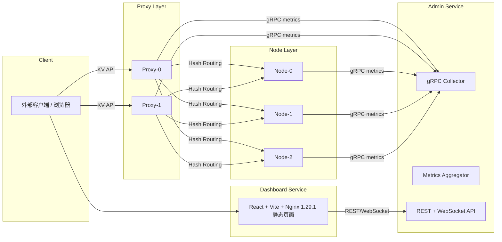

## 🧭 一、整体架构总览



---

## 🧱 二、Node 的职责与 Metrics（哑存储）

### 📌 职责

Node 是纯哑存储（dumb storage）：

* 不做一致性、不参与路由、不直接暴露 API
* 对 Proxy 提供最基础的 **KV 增删改查** 接口
* 本地维护 TTL、Value、热点 Key 等
* 周期性向 Admin 上报自身存储状态

| 功能                   | 说明                                       |
| -------------------- | ---------------------------------------- |
| `Get(key)`           | 读取 Key 的值，若不存在返回 Miss                    |
| `Set(key, val, ttl)` | 写入 KV 数据（带可选 TTL）                        |
| `Delete(key)`        | 删除 Key                                   |
| `Exists(key)`        | 判断 Key 是否存在                              |
| TTL 管理               | Node 内部实现，自动过期                           |
| 存储结构                 | 内存 HashMap + TTL + 热点计数（或 RocksDB 轻量持久化） |

---

### 📊 Node 必须提供的 Metrics（gRPC → Admin）

通过长连接 / 定时推送，向 Admin 汇报以下数据：

**📌 Snapshot（当前状态）**

```json
{
  "id": "node-1",
  "uptime_s": 432000,
  "memory_bytes": {"used": 1342177280, "max": 2147483648},
  "key_count": 1219334,
  "hit_count": 345932120,
  "miss_count": 1934242,
  "hot_keys": [
    {"key": "user:123", "freq": 23424},
    {"key": "session:xyz", "freq": 21233}
  ],
  "status": "healthy"
}
```

**📈 Timeseries（用于折线图）**

* 内存使用趋势
* hit/miss 随时间变化
* 热点 key 访问频率前 N 名

👉 Node 不需要统计 QPS，因为所有请求都由 Proxy 处理。

---

## 🌐 三、Proxy 的职责与 Metrics（哈希路由 + API 层）

### 📌 职责

Proxy 是对外的 API 层，也是负载路由器：

* 通过一致性哈希（JumpHash / Ketama）确定 key 所属 Node
* 对外提供 KV 增删改查 HTTP/gRPC API
* 管理 namespace 分布、节点健康状态
* 向 Admin 汇报 Proxy 侧请求/延迟/QPS 数据

| 功能           | 说明                        |
| ------------ | ------------------------- |
| 一致性哈希路由      | Key → Node 映射（可动态增删 Node） |
| KV CRUD API  | `GET /set/delete/exists`  |
| Namespace 管理 | 维护 namespace → node 分布    |
| Node 健康管理    | Node 掉线时临时标记不可用，不参与路由     |
| TTL 透传       | Set 时透传 TTL 给 Node        |

---

### 📊 Proxy 必须提供的 Metrics（gRPC → Admin）

**📌 Snapshot**

```json
{
  "id": "proxy-1",
  "uptime_s": 345000,
  "qps": {"get": 1200, "set": 340, "del": 23},
  "latency_ms": {"p50": 1.2, "p90": 2.1, "p99": 4.0},
  "error_rate": 0.0003,
  "connections": 123,
  "namespaces": ["user-cache", "ads", "game"],
  "status": "healthy"
}
```

**📈 Timeseries**

* QPS（get/set/delete）曲线
* 延迟分布（P50/P90/P99）
* 错误率趋势

👉 Proxy 是前端 Dashboard 上 QPS 与延迟曲线的主数据来源。

---

## 🧠 四、Admin 微服务设计

Admin 是整个监控体系的“控制平面”，职责：

| 模块             | 功能                                                          |
| -------------- | ----------------------------------------------------------- |
| gRPC Collector | 与 Proxy/Node 保持连接，收集 Metrics（Snapshot + Timeseries + Event） |
| Aggregator     | 聚合全局数据，按 Node/Proxy/Namespace 组织，内存存储环形缓冲（无外部 DB）           |
| REST API       | 提供 Dashboard 查询接口（Overview、List、History、Key 查询）             |
| WebSocket API  | 向 Dashboard 推送实时更新（overview、proxy_update、node_update、event） |
| 健康检测           | 断连时标记节点 unhealthy，触发事件推送                                    |

---

### 📡 REST API 设计（示例）

| 路径                              | 功能                         |
| ------------------------------- | -------------------------- |
| `GET /api/overview`             | 集群总览（Node/Proxy 数量、总体命中率等） |
| `GET /api/proxies`              | 所有 Proxy 状态列表              |
| `GET /api/nodes`                | 所有 Node 状态列表               |
| `GET /api/query?ns=...&key=...` | 查询 Key 内容                  |
| `GET /api/node/:id/timeseries`  | 某 Node 历史数据                |
| `GET /api/proxy/:id/timeseries` | 某 Proxy 历史数据               |

### 🧵 WebSocket 推送（例）

```json
{
  "type": "proxy_update",
  "data": {
    "id": "proxy-1",
    "qps": {"get": 1300},
    "latency_ms": {"p90": 2.0}
  }
}
```

Dashboard 只需连接 `/ws`，Admin 会持续推送增量更新。

---

## 🖥 五、Dashboard：Vite + React + Nginx 1.29.1

Dashboard 是一个完全独立的前端微服务，
用 Vite + React 构建，打包后用 Nginx 1.29.1 容器部署。

### 📁 前端技术栈

| 技术                  | 用途                    |
| ------------------- | --------------------- |
| Vite                | 本地构建工具，产出 `dist` 静态文件 |
| React + TS          | 组件化 UI + 状态管理         |
| Chart.js/ECharts    | 折线图、仪表盘等              |
| WebSocket + fetch   | 实时数据 + REST 查询        |
| Tailwind/Ant Design | UI 样式框架               |

### 📦 本地构建（CI/CD 也类似）

```bash
npm install
npm run build   # 生成 dist/
```

### 🐳 Dockerfile（Nginx 镜像）

```dockerfile
FROM nginx:1.29.1-alpine
COPY dist /usr/share/nginx/html
COPY nginx.conf /etc/nginx/conf.d/default.conf
```

### 📄 nginx.conf 示例

```nginx
server {
    listen 80;
    server_name _;

    location / {
        root /usr/share/nginx/html;
        try_files $uri /index.html;
    }

    location /api/ {
        proxy_pass http://admin-service.default.svc.cluster.local:8080/;
    }

    location /ws {
        proxy_pass http://admin-service.default.svc.cluster.local:8080;
        proxy_http_version 1.1;
        proxy_set_header Upgrade $http_upgrade;
        proxy_set_header Connection "upgrade";
    }
}
```

👉 不需要 Node.js 运行时，纯静态页面 + Nginx，镜像极小，K8s 启动快。

---

## ✅ 七、方案优势总结

| 方面        | 改进后效果                                                  |
| --------- | ------------------------------------------------------ |
| 架构分层清晰    | Node = 储存；Proxy = 路由/API；Admin = 观测；Dashboard = 展示     |
| 实时监控      | Proxy/Node → gRPC → Admin → WebSocket → Dashboard 实时更新 |
| 部署轻量      | Dashboard = 静态 + Nginx；Admin = Go；Node/Proxy 无状态       |
| 易于扩展      | Dashboard、Admin、Proxy、Node 都可独立扩缩容                     |
| 前后端解耦     | Dashboard 与 Admin 只通过 API 通信，前端框架可独立演进                 |
| 符合云原生最佳实践 | 所有组件可作为独立微服务在 K8s 中滚动升级/自动扩容                           |

---

## 📝 TL;DR 总结

> 🟣 **Node**：哑存储 → 提供 KV 接口 + hit/miss/memory/hotkey Metrics
> 🟢 **Proxy**：对外 API + 一致性哈希 → 提供 QPS/延迟/错误率 Metrics
> 🧠 **Admin**：集中收集 Metrics → 提供 REST + WebSocket → 不持久化
> 🖥 **Dashboard**：Vite + React 构建 → Nginx 1.29.1 部署 → K8s 独立服务

👉 这套方案是一个完整的「**云原生 + 微服务 + 实时监控**」的标准实现。
无需外部数据库，轻量、高性能，可后续平滑接入 Prometheus / Grafana。
